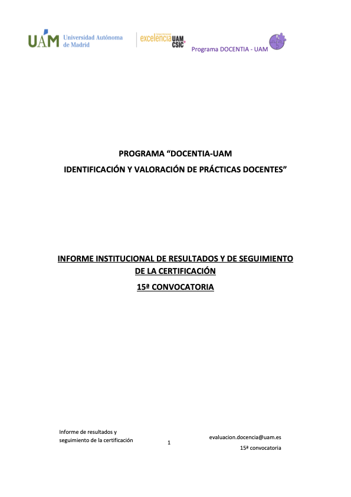
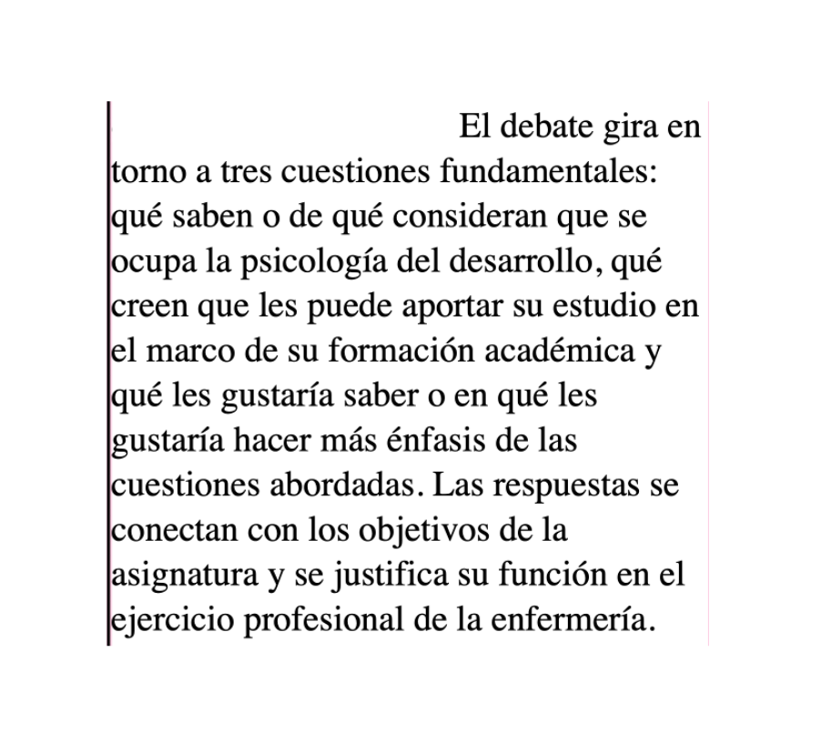
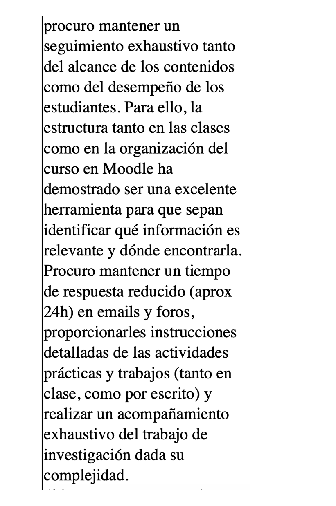
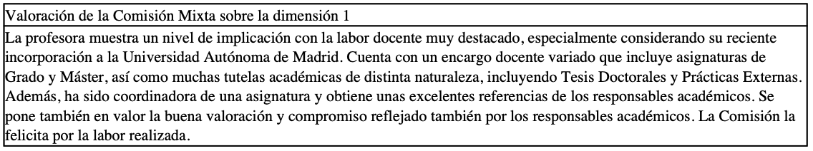

::: evidence-page

::: evidence-header

::: evidence-kicker
Evidencia · Parte 0
:::

::: evidence-title
Poner palabras a una forma de enseñar
:::

::: evidence-subtitle
Programa DOCENTIA-UAM, primera evaluación (2022)
:::

:::

::: evidence-layout

::: evidence-aside

::: evidence-cover

:::

::: evidence-meta
**Programa:** DOCENTIA-UAM

**Año:** 2022

**Periodo evaluado:** 2018-2021
:::

:::

::: evidence-main

Esta evidencia recoge extractos de mi primera participación en el programa DOCENTIA-UAM, correspondiente a la evaluación de la actividad docente desarrollada entre los cursos 2018-2019 y 2020-2021. En aquel momento todavía no había iniciado el Título de Experto en Mentoría Universitaria, pero al releer estos materiales reconozco algunas preocupaciones que después adquirirían un significado más amplio en mi forma de entender el acompañamiento docente.

Más que detenerme en el resultado de la evaluación, esta evidencia me permite mirar hacia atrás y reconocer una forma de enseñar que ya estaba orientada por la escucha del alumnado, el seguimiento del proceso, la retroalimentación y el ajuste progresivo de la práctica. También marca una diferencia importante respecto a evidencias anteriores: la aparición de una mirada externa que empieza a devolver una imagen sistemática de esa práctica y a convertirla en objeto de análisis.

### Partir de quienes aprenden

::: evidence-reading
Uno de los aspectos que más me llama la atención al releer este informe es la importancia que ya concedía a conocer el punto de partida del alumnado. Antes de desarrollar los contenidos, aparecen preguntas orientadas a identificar qué saben, qué esperan, qué necesitan y cómo conectan la asignatura con su formación.

Esta preocupación anticipa una idea que después sería central en mi proceso de aprendizaje como mentora: antes de intervenir, diseñar o proponer cambios, es necesario comprender desde dónde se construye la experiencia de quienes participan en el proceso.
:::

::: evidence-fragment

::: evidence-caption
Extracto sobre análisis del perfil del alumnado y ajuste de la enseñanza.
:::
:::

### Acompañar el proceso

::: evidence-reading
También aparece con claridad una forma de entender la docencia como acompañamiento sostenido. La práctica docente no se describe únicamente como transmisión de contenidos, sino como organización de condiciones para que el alumnado pueda avanzar: instrucciones claras, seguimiento regular, entregas intermedias y retroalimentación cualitativa.

Vista desde hoy, esta evidencia muestra una preocupación temprana por hacer visible el proceso de aprendizaje y no solo el resultado final.
:::

::: evidence-fragment

::: evidence-source
Extracto sobre seguimiento, estructura y acompañamiento del trabajo del alumnado.
:::
:::

### Una mirada externa sobre la práctica

::: evidence-reading
El informe de retroalimentación de DOCENTIA ofreció una primera mirada externa sobre mi actividad docente. La valoración obtenida reconocía la implicación con la docencia, la diversidad del encargo asumido y el compromiso con tareas de tutela, coordinación y participación institucional.

Al releerlo hoy, lo más relevante no es la categoría alcanzada, sino el modo en que esa mirada externa empezó a devolver una imagen de mi práctica docente como algo que podía ser analizado, documentado y pensado en términos de desarrollo profesional.
:::

::: evidence-fragment

::: evidence-source
Extracto del informe de retroalimentación DOCENTIA-UAM.
:::
:::

### Lo que veo hoy al releer esta evidencia

::: evidence-reflection
Al releer estos materiales reconozco que muchas de las preocupaciones que después se volverían centrales en mi formación como mentora ya estaban presentes en mi práctica docente: escuchar el punto de partida del alumnado, ajustar las decisiones a partir de evidencias, acompañar procesos complejos y ofrecer retroalimentación útil.

Sin embargo, lo que hace especialmente significativa esta evidencia no es únicamente la presencia temprana de esas preocupaciones. Es también la aparición de una mirada externa construida a partir de la documentación, el análisis y la devolución sistemática de una imagen de la propia práctica docente. Vista desde hoy, esta experiencia anticipa una idea que después adquiriría un papel central en la mentoría universitaria: la importancia de construir espacios donde la práctica pueda hacerse visible, ser interpretada junto a otros y convertirse en objeto de reflexión profesional.
:::

[Volver a Parte 0 - empezar](../part0.html){.evidence-back-button}

:::

:::

:::