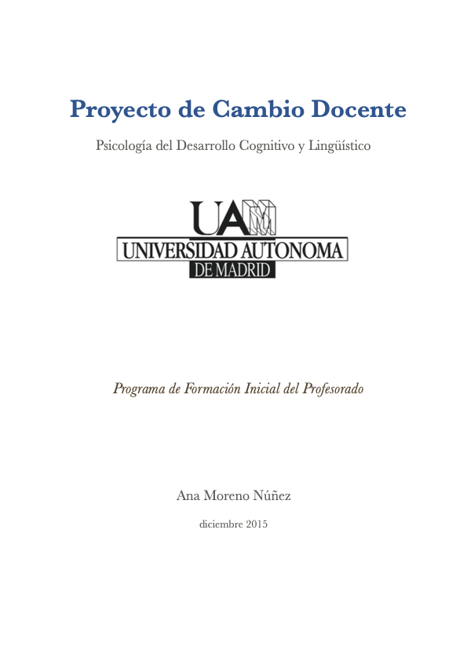
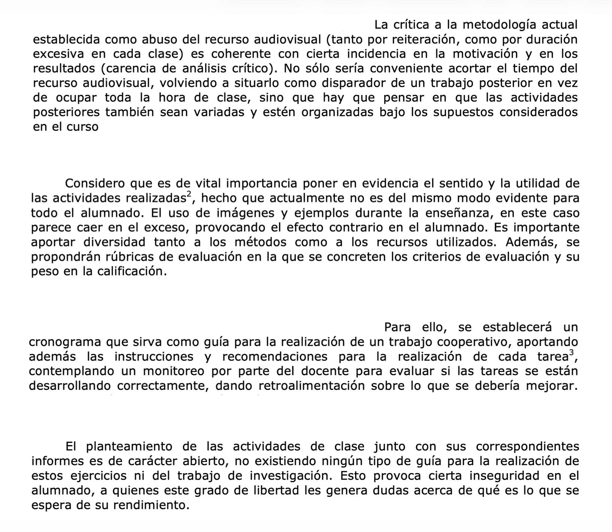
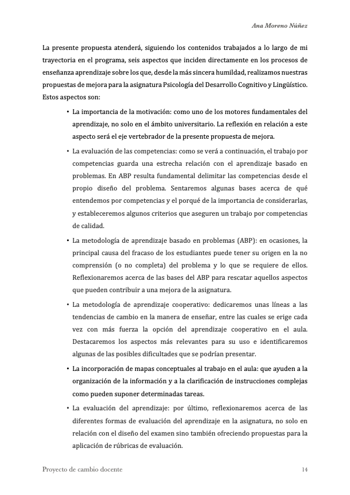
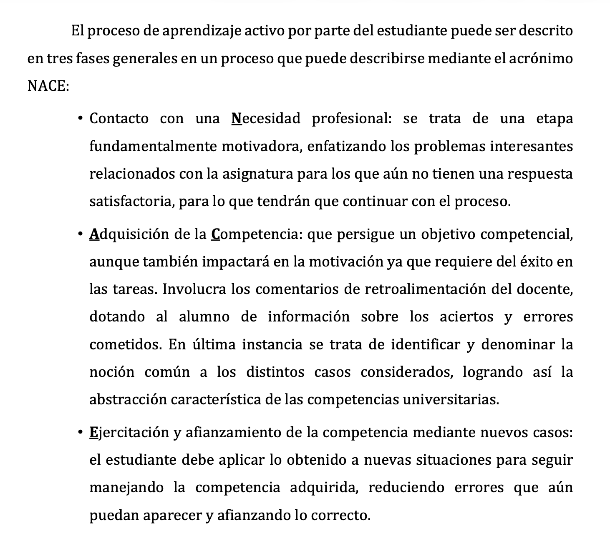
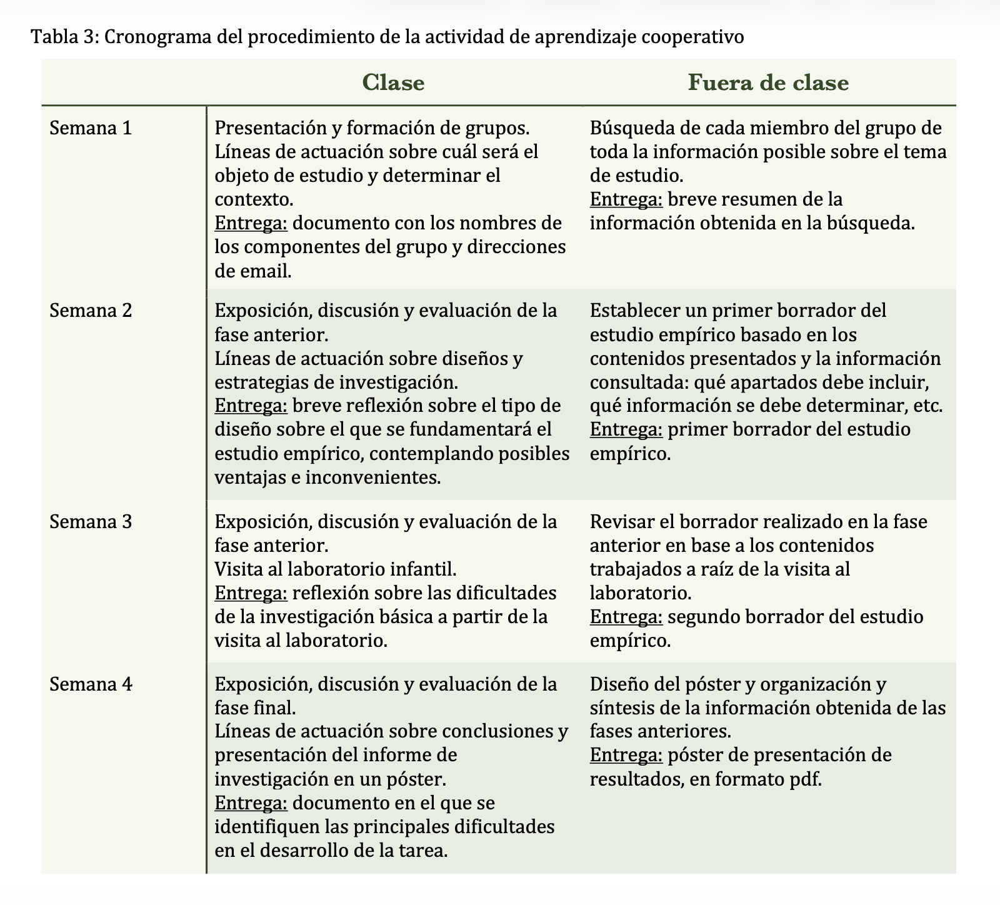

::: evidence-page

::: evidence-header

::: evidence-kicker
Evidencia · Parte 0
:::

::: evidence-title
Una primera mirada al cambio docente
:::

::: evidence-subtitle
Título de Experto en Docencia Universitaria (2015)
:::

:::

::: evidence-layout

::: evidence-aside

::: evidence-cover

:::

::: evidence-meta
**Programa:** Título de Experto en Docencia Universitaria (UAM)

**Año:** 2015
:::

:::

::: evidence-main

Esta evidencia recoge extractos del Proyecto de Cambio Docente desarrollado en 2015 como trabajo final del entonces Título de Experto en Docencia Universitaria. 
En aquel momento era Personal Docente e Investigador en Formación y me encontraba en los primeros años de mi trayectoria docente. 
Revisar este proyecto me ha permitido identificar algunas de las preocupaciones que ya orientaban mi práctica, así como la forma en que entendía entonces los procesos de mejora docente.

### Qué me preocupaba entonces

::: evidence-reading
Ya en la primera propuesta aparecen cuestiones que siguen presentes en mi práctica docente actual: la necesidad de que las actividades tengan sentido para el alumnado, la importancia de hacer explícitas las expectativas de aprendizaje y el papel de la retroalimentación para acompañar el trabajo realizado.
:::

::: evidence-fragment

::: evidence-caption
Extractos de la propuesta previa al Proyecto de Cambio Docente.
:::
:::

### Cómo entendía el cambio docente

::: evidence-reading
La propuesta se articulaba en torno a seis ejes de mejora relacionados con la motivación, las metodologías activas y la evaluación del aprendizaje. 
La mejora se concebía principalmente como un problema de diseño: seleccionar metodologías adecuadas, secuenciar actividades, definir competencias y planificar procedimientos de evaluación coherentes.
:::

::: evidence-fragment

::: evidence-source
Extracto del Proyecto de Cambio Docente, 2015.
:::
:::

### Cómo intentaba materializar ese cambio

::: evidence-reading
El esquema de trabajo proponía organizar el aprendizaje como una secuencia estructurada que vinculaba motivación, adquisición de competencias, retroalimentación y aplicación a nuevas situaciones.
El cambio se concretaba mediante una secuencia estructurada de actividades, entregas intermedias y espacios de seguimiento orientados a acompañar el trabajo del alumnado.
:::

::: evidence-fragment

::: evidence-source
Ejemplos de las propuestas de cambio.
:::
:::

### Lo que veo hoy al releer esta evidencia

::: evidence-reflection
Una década después sigo reconociendo en este proyecto preocupaciones que continúan presentes en mi práctica docente: la importancia de la motivación, la necesidad de ofrecer retroalimentación útil o el interés por promover formas activas de aprendizaje. Sin embargo, también reconozco una concepción del cambio centrada principalmente en el diseño de actividades y en la planificación de la enseñanza. La experiencia posterior, y especialmente el trabajo desarrollado en el ámbito de la mentoría universitaria, me ha llevado a prestar mayor atención a los procesos de interpretación, a las condiciones que sostienen los cambios y al papel de las relaciones profesionales en la transformación de la práctica docente.
:::

[Volver a Parte 0 - empezar](../part0.html#tedu){.evidence-back-button}

:::

:::

:::