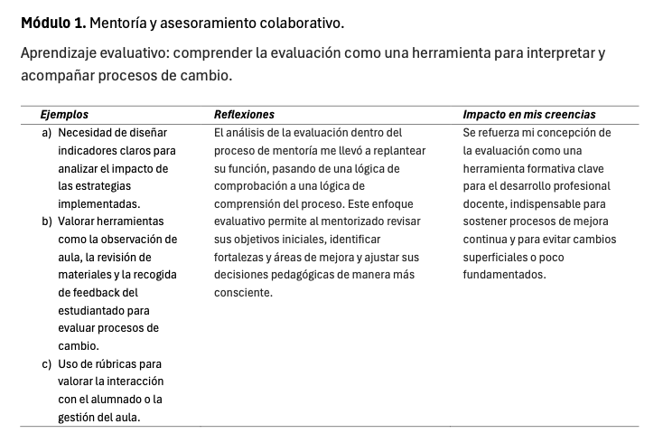
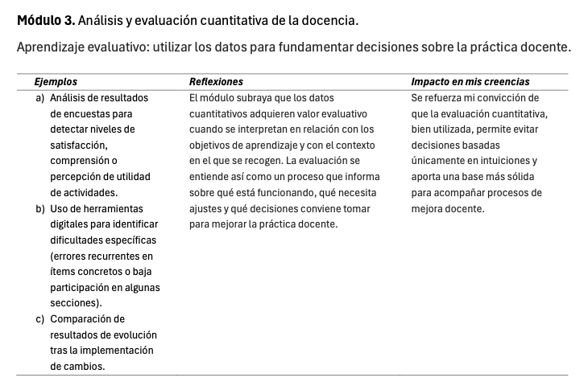
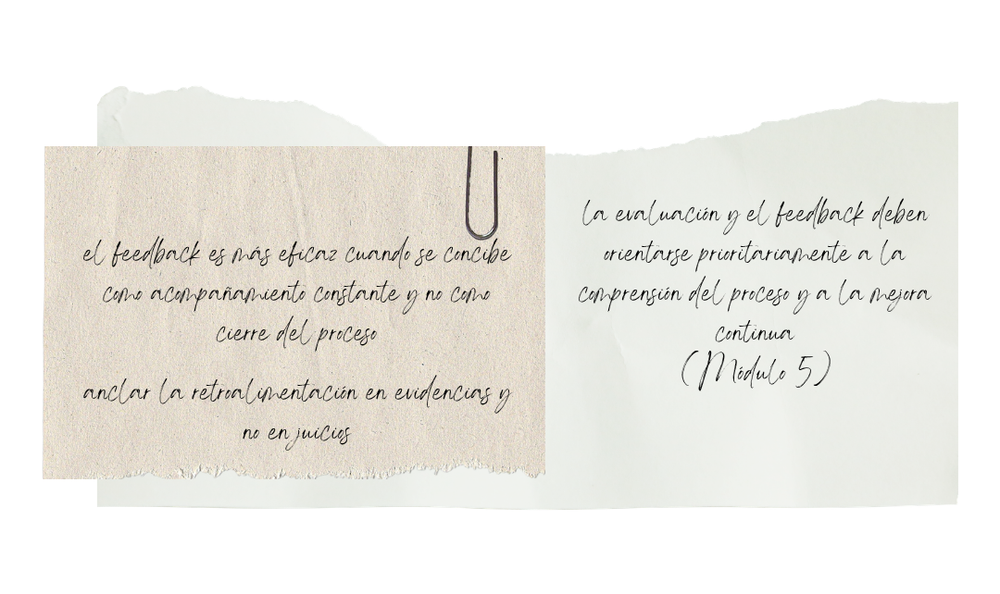

::: evidence-page

::: evidence-header

::: evidence-kicker
Evidencia · Parte I
:::

::: evidence-title
Evaluar para comprender lo que cambia
:::

::: evidence-subtitle
Título de Experto en Mentoría Universitaria, primer año (2025)
:::

:::

::: evidence-layout

::: evidence-aside

::: evidence-cover

:::

::: evidence-meta
**Programa:** Título de Experto en Mentoría Universitaria (UAM)

**Año:** 2024-2026

**Dimensión:** Evaluativa
:::

:::

::: evidence-main

Esta evidencia recoge extractos de distintos trabajos, actividades y reflexiones elaborados durante el primer año del Título de Experto en Mentoría Universitaria (TEMU). Al releerlos hoy desde la dimensión evaluativa, reconozco un desplazamiento importante en mi manera de comprender la evaluación dentro de los procesos de mentoría y cambio docente.
La evaluación deja de aparecer únicamente como una forma de comprobar resultados y empieza a entenderse como una herramienta para interpretar procesos, orientar decisiones y sostener la mejora.

### Qué empezaba a cuestionar

::: evidence-reading
En esas primeras reflexiones, la evaluación del cambio docente aparecía todavía muy ligada a la comprobación de objetivos alcanzados y a la valoración de resultados visibles. Sin embargo, las reflexiones elaboradas durante el primer año del TEMU muestran un desplazamiento progresivo hacia una comprensión más formativa de la evaluación.

Empecé a reconocer que evaluar no consiste solo en verificar si una propuesta ha funcionado, sino en comprender qué ha ocurrido durante el proceso, qué ajustes han sido necesarios y qué aprendizajes se han producido en el camino.
:::

::: evidence-fragment

::: evidence-caption
Extractos sobre la evaluación como comprensión del proceso.
:::
:::

### Cómo cambió mi manera de interpretar las evidencias

::: evidence-reading
Otro cambio relevante tiene que ver con el valor de los datos y las evidencias. Los textos muestran una transición desde una mirada centrada en la recogida de información hacia una comprensión más situada e interpretativa de la evaluación.

Los datos cuantitativos, las observaciones, las reflexiones escritas o las evidencias cualitativas empiezan a adquirir sentido no por sí mismos, sino por su capacidad para ayudar a interpretar la práctica docente en relación con sus objetivos, su contexto y las decisiones que se van tomando.
:::

::: evidence-fragment

::: evidence-source
Extractos sobre el uso situado de datos y evidencias.
:::
:::

### Qué implicaciones tenía para comprender la mejora docente

::: evidence-reading
Estas comprensiones empezaban a transformar también mi manera de entender la mejora docente. La evaluación dejaba de situarse únicamente al final del proceso y comenzaba a aparecer como una forma de comprender qué aspectos de la experiencia educativa quedaban fuera de los resultados más visibles.

Desde esta mirada, las evidencias cualitativas adquirían un valor específico: permitían interpretar por qué determinadas prácticas no generaban el nivel de implicación o aprendizaje esperado, y ayudaban a repensar el diseño de actividades, las consignas, los tiempos de trabajo y las formas de acompañamiento.
:::

::: evidence-fragment

::: evidence-source
Extractos sobre evaluación cualitativa y comprensión de la experiencia educativa.
:::
:::

### Lo que veo hoy al releer esta evidencia

::: evidence-reflection
Al releer estos materiales reconozco una reformulación importante de mi mirada evaluativa. La evaluación empieza a alejarse de una lógica de cierre, comprobación o juicio, y se aproxima a una lógica de acompañamiento, comprensión y toma de decisiones informada.

Hoy veo en estas reflexiones una idea que después sería central en mi manera de entender la mentoría universitaria: los procesos de cambio docente necesitan evidencias, pero esas evidencias solo tienen valor cuando se interpretan de forma contextualizada y se ponen al servicio de la reflexión compartida. Evaluar no es añadir una medición al final del proceso, sino construir condiciones para comprender mejor qué está cambiando, por qué está cambiando y cómo puede sostenerse ese cambio.
:::

[Volver a Parte I - comprender](../part1.html){.evidence-back-button}

:::

:::

:::