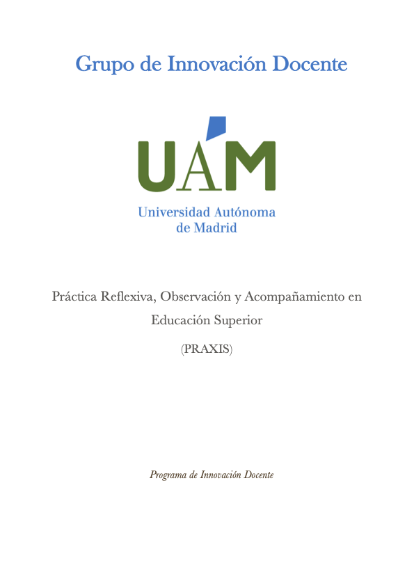
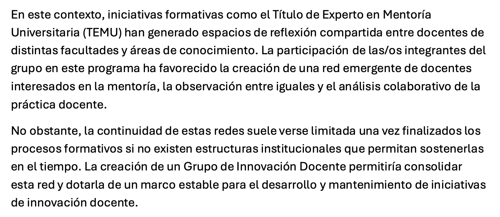
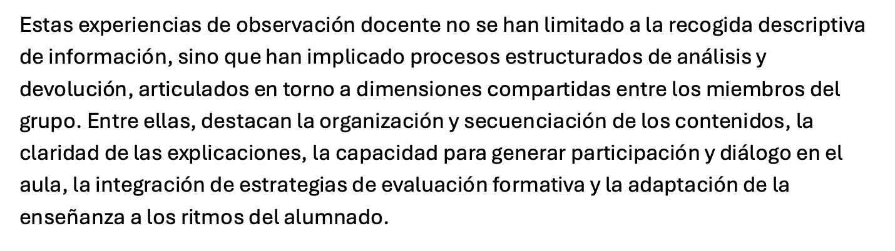
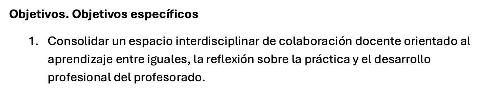

::: evidence-page

::: evidence-header

::: evidence-kicker
Evidencia · Parte III
:::

::: evidence-title
Sostener la conversación
:::

::: evidence-subtitle
Grupo de Innovación Docente - PRAXIS (2026)
:::

:::

::: evidence-layout

::: evidence-aside

::: evidence-cover

:::

::: evidence-meta
**Programa:** Grupo de Innovación Docente PRAXIS

**Año:** 2026
:::

:::

::: evidence-main
Esta evidencia recoge fragmentos del Grupo de Innovación Docente PRAXIS, una iniciativa surgida tras la experiencia compartida en el programa TEMU. Al releer estos materiales, reconozco un desplazamiento importante en mi manera de entender el acompañamiento docente.

Durante mucho tiempo tendí a pensar la mentoría principalmente como una relación que se construye entre personas concretas. Sin abandonar esa idea, empecé a comprender que algunas de las transformaciones más valiosas dependen también de la existencia de espacios colectivos capaces de sostener el intercambio profesional más allá de procesos formales o temporales.

### La necesidad de continuar la conversación

::: evidence-reading
Una de las consecuencias inesperadas del proceso de mentoría fue reconocer que muchas de las preguntas más relevantes no se agotan cuando finaliza un acompañamiento concreto. La reflexión sobre la práctica docente necesita tiempo, continuidad y oportunidades para volver sobre cuestiones que rara vez encuentran espacio en la actividad académica cotidiana.

El origen del grupo refleja precisamente esa necesidad de mantener abiertos espacios de conversación profesional orientados al aprendizaje mutuo.
:::

::: evidence-fragment

::: evidence-caption
Extracto sobre el origen y sentido del grupo.
:::
:::

### Aprender a través de la mirada de otros

::: evidence-reading
El grupo se articula alrededor de prácticas que habían adquirido un papel importante durante el TEMU: la observación entre iguales, la retroalimentación formativa y la reflexión compartida sobre la enseñanza.

Más que intercambiar recomendaciones o compartir recursos, estas actividades generan oportunidades para ampliar las formas de interpretar la propia práctica y reconocer posibilidades que resultan difíciles de identificar desde una única perspectiva.
:::

::: evidence-fragment

::: evidence-source
Extracto sobre observación, retroalimentación y aprendizaje compartido.
:::
:::

### Del acompañamiento individual a la comunidad de práctica

::: evidence-reading
Uno de los desplazamientos más importantes que reconozco en este proyecto es el paso desde una concepción más individual del acompañamiento hacia una mirada que incorpora la dimensión colectiva del desarrollo profesional.

La comunidad deja de aparecer únicamente como un contexto donde compartir experiencias para convertirse en una estructura capaz de sostener procesos de reflexión, colaboración y aprendizaje a largo plazo.
:::

::: evidence-fragment

::: evidence-source
Extracto sobre la construcción de una comunidad docente sostenible.
:::
:::

### Lo que veo hoy al releer esta evidencia

::: evidence-reflection
Al releer estos materiales reconozco que una de las transformaciones más significativas de mi paso por el TEMU tiene que ver con la forma de entender las relaciones profesionales.

El vínculo sigue ocupando un lugar central, pero ya no aparece únicamente como una condición para el acompañamiento individual. Empiezo a verlo también como algo que puede extenderse, multiplicarse y adquirir formas colectivas capaces de sostener procesos de aprendizaje compartido.

En retrospectiva, el interés de este proyecto no reside únicamente en las actividades que propone, sino en la convicción que lo sustenta: algunas conversaciones sobre la docencia merecen encontrar estructuras que les permitan continuar. En ese sentido, empiezo a reconocer que construir relaciones profesionales no consiste únicamente en acompañar a personas concretas, sino también en crear las condiciones que permitan que esas conversaciones sigan produciéndose cuando el acompañamiento formal termina.
:::

[Volver a Parte III - sostener](../part3.html){.evidence-back-button}

:::

:::

:::