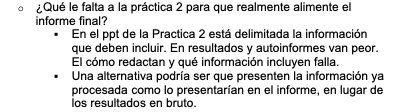
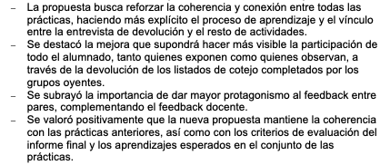
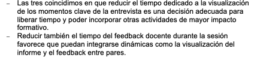
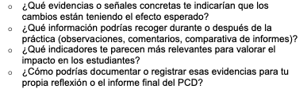

::: evidence-page

::: evidence-header

::: evidence-kicker
Evidencia · Parte II
:::

::: evidence-title
Preguntas que dan forma a las decisiones
:::

::: evidence-subtitle
Título de Experto en Mentoría Universitaria, segundo año (2026)
:::

:::

::: evidence-layout

::: evidence-aside

::: evidence-cover

:::

::: evidence-meta
**Programa:** Título de Experto en Mentoría Universitaria (UAM)

**Año:** 2024-2026
:::

:::

::: evidence-main

Esta evidencia recoge fragmentos de los procesos de acompañamiento desarrollados durante el segundo año del TEMU. Al releer las síntesis de las reuniones, reconozco un desplazamiento importante en mi manera de entender la mentoría. Lo que inicialmente concebía como un espacio para ayudar a resolver problemas concretos empezó a convertirse en un proceso orientado a comprender mejor las situaciones antes de decidir cómo actuar sobre ellas.

### Lo que parecía ser el problema

::: evidence-reading
El proceso de acompañamiento comenzó a partir de una demanda relativamente concreta relacionada con el funcionamiento de determinadas actividades de una asignatura. Como ocurre con frecuencia en mentoría, la tentación inicial era pensar en términos de soluciones: qué modificar, qué añadir o qué sustituir para resolver las dificultades detectadas.

Sin embargo, las primeras conversaciones fueron desplazando la atención desde las posibles respuestas hacia una pregunta previa: qué función cumplían realmente esas actividades dentro del conjunto de la asignatura y qué papel desempeñaban en los aprendizajes que se pretendían promover. Antes de decidir qué cambiar, resultaba necesario comprender mejor qué problema se estaba intentando resolver.
:::

::: evidence-fragment

::: evidence-caption
Extracto de una sesión de acompañamiento centrada en la reformulación del problema inicial.
:::
:::

### Lo que empezó a cambiar

::: evidence-reading
A medida que avanzaban las reuniones, el foco dejó de situarse en elementos aislados para desplazarse hacia las relaciones entre ellos. Las preguntas ya no se centraban únicamente en actividades concretas, sino en cómo se articulaban entre sí, qué aprendizajes favorecían y de qué manera se conectaban con la evaluación y con los objetivos de la asignatura.

La comprensión del problema empezó así a construirse de forma más sistémica. Algunas decisiones que inicialmente parecían evidentes dejaron de serlo, mientras que otras comenzaron a cobrar sentido al observar cómo afectaban al conjunto del proceso formativo.
:::

::: evidence-fragment

::: evidence-source
Extracto sobre coherencia, articulación de actividades y visión de conjunto.
:::
:::

### Decisiones que surgieron de una comprensión más precisa

::: evidence-reading
Una consecuencia importante de este proceso fue reconocer que mejorar una asignatura no implica necesariamente añadir nuevos elementos. En ocasiones, comprender mejor una situación conduce precisamente a identificar qué aspectos conviene simplificar, reorganizar o priorizar para que otros elementos puedan adquirir mayor protagonismo.

Las decisiones que finalmente se plantearon no surgieron de una búsqueda de innovación por sí misma, sino de una comprensión progresivamente más afinada de qué aspectos contribuían realmente a los objetivos perseguidos y cuáles podían estar dificultándolos.
:::

::: evidence-fragment

::: evidence-source
Extractos sobre priorización, renuncias y toma de decisiones.
:::
:::

### Las preguntas como forma de intervención

::: evidence-reading
Otro aprendizaje importante tuvo que ver con el papel de las preguntas dentro del proceso de mentoría. En lugar de orientar la conversación hacia respuestas predeterminadas, muchas de las decisiones más relevantes surgieron de preguntas que ayudaban a precisar qué evidencias resultaría útil observar, qué cambios se esperaba producir y cómo podría valorarse su impacto.

La intervención empezaba así a desplazarse desde la recomendación hacia la exploración conjunta de posibilidades. Formular determinadas preguntas no resolvía el problema, pero contribuía a construir una comprensión más precisa de la situación y de las decisiones que podían derivarse de ella.
:::

::: evidence-fragment

::: evidence-source
Extracto sobre el papel de las preguntas en el acompañamiento docente.
:::
:::

### Lo que veo hoy al releer esta evidencia

::: evidence-reflection
Al inicio del proceso tendía a pensar que acompañar consistía en ayudar a encontrar soluciones. Estas reuniones me hicieron reconocer que muchas veces la aportación más relevante de la mentoría no consiste en proponer respuestas, sino en generar condiciones para que los problemas puedan formularse de manera más precisa. Comprender mejor una situación no garantiza resolverla, pero modifica las decisiones que se consideran posibles y permite actuar con mayor intención.
:::

[Volver a Parte II - acompañar](../part2.html){.evidence-back-button}

:::

:::

:::