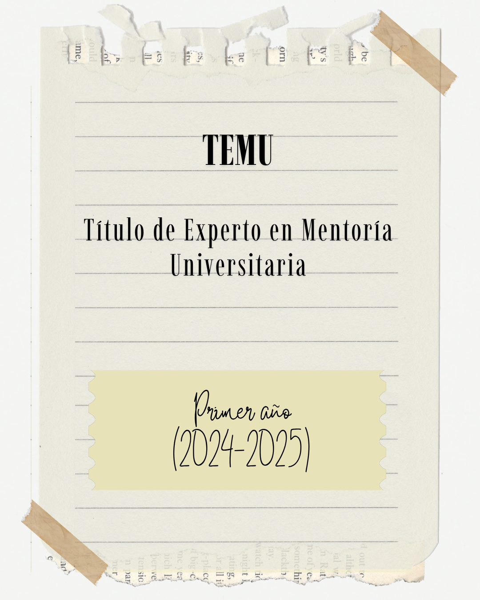
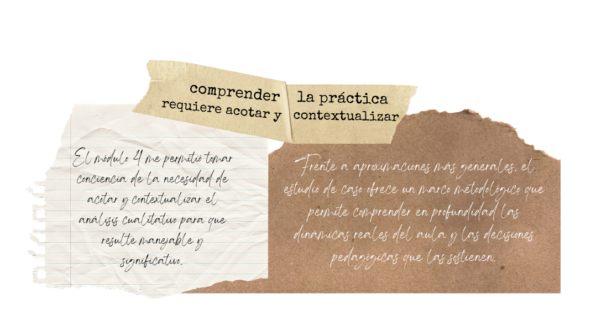
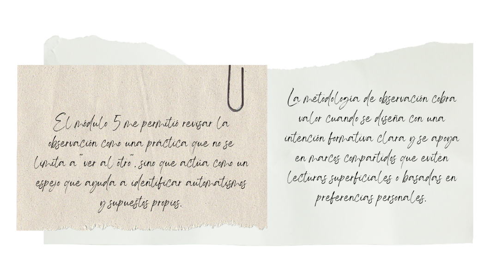
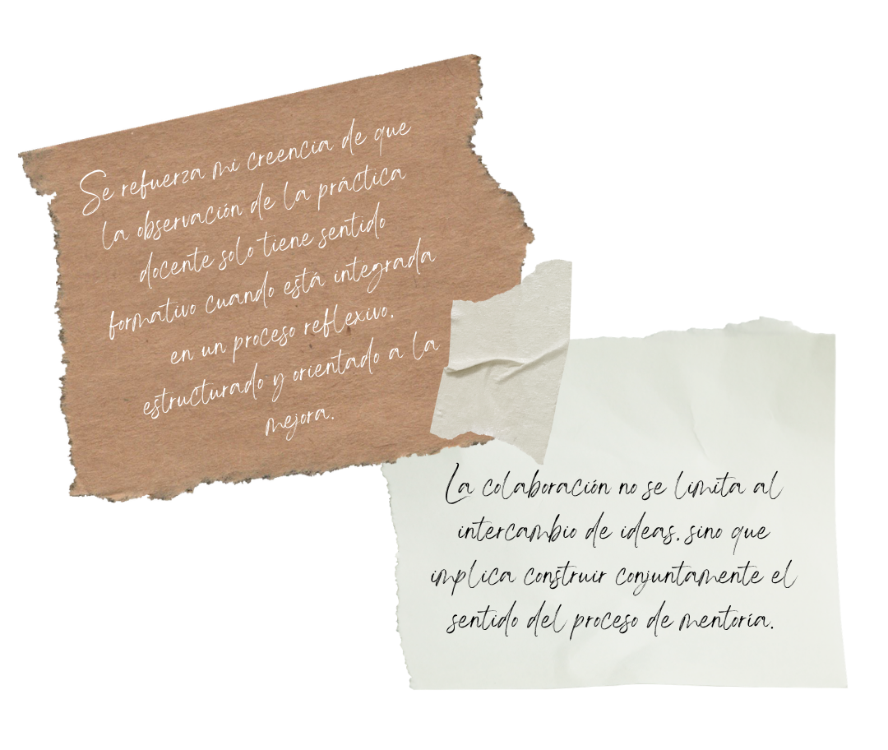

::: evidence-page

::: evidence-header

::: evidence-kicker
Evidencia · Parte I
:::

::: evidence-title
Reorganizando aprendizajes
:::

::: evidence-subtitle
Título de Experto en Mentoría Universitaria, primer año (2025)
:::

:::

::: evidence-layout

::: evidence-aside

::: evidence-cover

:::

::: evidence-meta
**Programa:** Título de Experto en Mentoría Universitaria (UAM)

**Año:** 2024-2026

**Dimensión:** Metodológica
:::

:::

::: evidence-main

Esta evidencia recoge extractos de distintos trabajos, actividades y reflexiones elaborados durante el primer año del Título de Experto en Mentoría Universitaria (TEMU). 
Al releerlos hoy, más que identificar técnicas o herramientas concretas, reconozco un cambio progresivo en mi manera de comprender cómo observar, analizar y acompañar la práctica docente. Muchas de las ideas que aparecen aquí anticipan una transformación metodológica que después se consolidaría en los años siguientes.

### Qué empezaba a cuestionar

::: evidence-reading
Al inicio del programa tendía a entender los procesos de mejora docente principalmente como problemas de diseño e implementación. Aunque seguía considerando importantes las metodologías, la evaluación o la planificación de las actividades, comenzó a resultarme cada vez más evidente que comprender una práctica docente exigía algo más que identificar fortalezas y debilidades o proponer cambios.

Las actividades relacionadas con el análisis cualitativo y el estudio de caso me llevaron a reconocer la importancia de trabajar sobre situaciones concretas y contextualizadas. Empecé a valorar la necesidad de delimitar el foco de análisis para poder comprender la complejidad de la práctica sin reducirla a categorías generales o soluciones rápidas.
:::

::: evidence-fragment

::: evidence-caption
Extractos sobre evaluación cualitativa y estudio de caso.
:::
:::

### Cómo cambió mi manera de observar

::: evidence-reading
Uno de los desplazamientos más importantes fue la transformación de mi concepción de la observación docente. La observación dejó de aparecer únicamente como una herramienta para recoger información sobre lo que sucede en el aula y comenzó a adquirir un sentido formativo.

Los textos muestran cómo empieza a emerger una idea de observación basada en la reflexión compartida, la explicitación de supuestos y la construcción conjunta de significados. También aparece la importancia de definir focos de observación claros y de apoyarse en marcos compartidos que permitan interpretar la práctica más allá de impresiones personales o juicios inmediatos.
:::

::: evidence-fragment

::: evidence-source
Extracto sobre observación docente y análisis de la práctica.
:::
:::

### Qué implicaciones tenía para el acompañamiento

::: evidence-reading
Estas primeras comprensiones metodológicas empezaban a desplazar también mi manera de entender el acompañamiento docente. La mejora ya no aparecía únicamente asociada a la introducción de nuevas estrategias o metodologías, sino a la posibilidad de generar espacios de análisis que ayudasen a comprender mejor la propia práctica.

Comencé a reconocer que observar no consistía simplemente en identificar problemas ni en ofrecer soluciones, sino en favorecer procesos de reflexión que permitieran hacer visibles aspectos de la práctica que normalmente permanecen implícitos. La observación adquiría así valor no tanto por la información que producía como por las conversaciones y procesos de interpretación que hacía posibles.
:::

::: evidence-fragment

::: evidence-source
Extractos relacionados con la dimensión formativa de la observación.
:::
:::

### Lo que veo hoy al releer esta evidencia

::: evidence-reflection
Al releer estos materiales reconozco uno de los cambios metodológicos más importantes de todo el proceso formativo. Empieza a aparecer una forma distinta de aproximarse a la práctica docente: menos centrada en intervenir rápidamente sobre los problemas y más orientada a comprender cómo se construyen las situaciones que posteriormente intentamos transformar.

Aunque todavía no había desarrollado una concepción plenamente articulada de la mentoría, muchas de las ideas que hoy considero centrales ya estaban presentes de manera incipiente: la importancia de observar con intención, la necesidad de construir marcos compartidos para interpretar la práctica y el valor de la reflexión conjunta como condición para el cambio. En retrospectiva, estos aprendizajes constituyen uno de los primeros antecedentes de la mirada metodológica que hoy orienta mi trabajo como mentora.
:::

[Volver a Parte I - comprender](../part1.html){.evidence-back-button}

:::

:::

:::