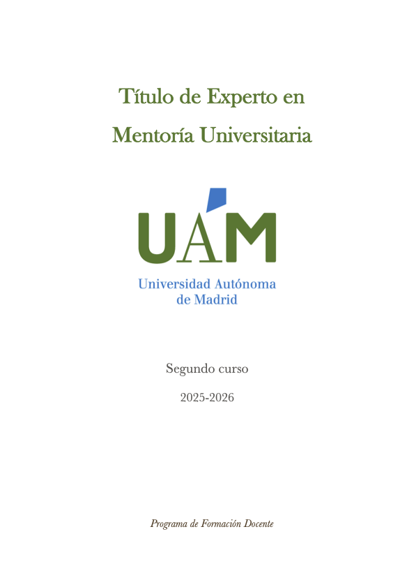
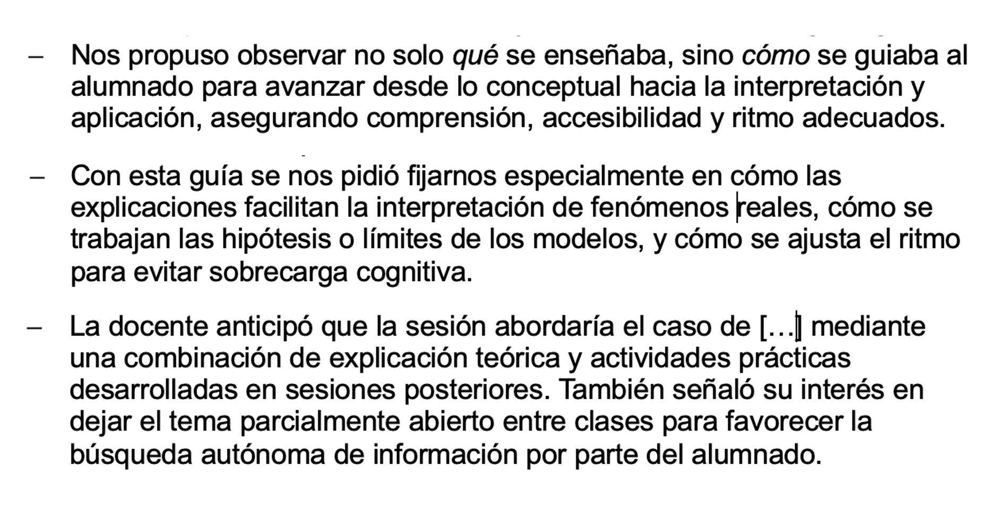
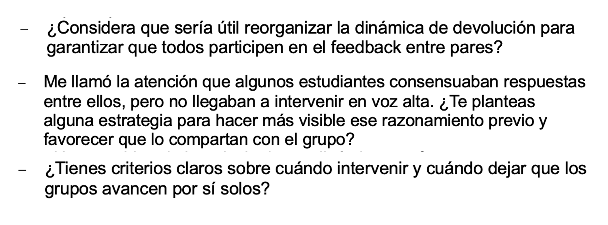
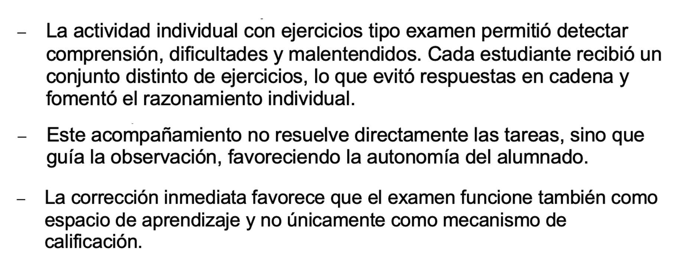

::: evidence-page

::: evidence-header

::: evidence-kicker
Evidencia · Parte II
:::

::: evidence-title
Aprender a mirar con otros
:::

::: evidence-subtitle
Título de Experto en Mentoría Universitaria, segundo año (2026)
:::

:::

::: evidence-layout

::: evidence-aside

::: evidence-cover

:::

::: evidence-meta
**Programa:** Título de Experto en Mentoría Universitaria (UAM)

**Año:** 2024-2026
:::

:::

::: evidence-main
Esta evidencia recoge extractos de las observaciones docentes realizadas durante el segundo año del Título de Experto en Mentoría Universitaria (TEMU). Al releerlas hoy, reconozco un desplazamiento importante en mi manera de comprender la observación entre iguales.

Inicialmente tendía a pensar la observación como una oportunidad para identificar prácticas interesantes o recoger ideas transferibles a mi propia docencia. Sin embargo, la experiencia de observar contextos muy diversos me llevó progresivamente a prestar atención a otro tipo de cuestiones: qué condiciones hacen posible que una observación resulte formativa, cómo se construyen los focos compartidos de análisis y qué aspectos de la práctica docente permanecen invisibles cuando observamos sin una intención clara.

### La observación empieza antes de entrar en el aula

::: evidence-reading
Uno de los aprendizajes más relevantes fue comprender que la observación no comienza cuando se inicia la clase, sino mucho antes. Las conversaciones previas con las personas observadas permitían identificar qué aspectos les interesaba explorar, qué preguntas estaban intentando responder y qué dimensiones de su práctica deseaban analizar con mayor profundidad.

Esta preparación previa transformaba el sentido de la observación. Dejaba de consistir en registrar todo lo que ocurría para centrarse en cuestiones que resultaban significativas para quien abría su aula a la mirada de otros compañeros.
:::

::: evidence-fragment

::: evidence-caption
Extractos de las conversaciones previas para construir los focos de observación.
:::
:::

### Las preguntas orientan la mirada

::: evidence-reading
Otro desplazamiento importante tuvo que ver con la función de las preguntas dentro del proceso de observación. Poco a poco fui comprendiendo que el valor de una observación no depende únicamente de la cantidad de información recogida, sino de la capacidad para generar preguntas que ayuden a interpretar la práctica desde nuevas perspectivas.

Las devoluciones elaboradas tras las observaciones muestran cómo el objetivo no era identificar errores ni emitir juicios rápidos, sino abrir posibilidades de reflexión que permitieran seguir pensando sobre cuestiones relevantes para la propia docencia.
:::

::: evidence-fragment

::: evidence-source
Ejemplos de preguntas surgidas a partir de las observaciones realizadas.
:::
:::

### Reconocer problemas pedagógicos compartidos

::: evidence-reading
La diversidad disciplinar de las observaciones constituyó otra fuente importante de aprendizaje. Aunque las asignaturas observadas pertenecían a ámbitos muy diferentes, muchas de las preocupaciones que aparecían en ellas resultaban sorprendentemente similares.

La participación del alumnado, el desarrollo de la autonomía, el uso formativo de la evaluación o la construcción de procesos de razonamiento complejos emergían una y otra vez en contextos aparentemente muy distintos. Observar otras disciplinas no solo permitió descubrir estrategias diferentes, sino también reconocer preguntas pedagógicas comunes que atraviesan la enseñanza universitaria.
:::

::: evidence-fragment

::: evidence-source
Extractos de observaciones realizadas en contextos interdisciplinares.
:::
:::

### Lo que veo hoy al releer esta evidencia

::: evidence-reflection
Al releer estas observaciones reconozco que uno de los aprendizajes más importantes no tuvo que ver con las prácticas observadas en sí mismas, sino con las condiciones que hacían posible aprender de ellas.

La observación entre iguales empezó a dejar de parecerme una herramienta destinada a identificar fortalezas o debilidades para convertirse en una práctica de indagación compartida. Comprendí que su valor depende menos de la capacidad para emitir juicios y más de la posibilidad de construir preguntas relevantes, describir con rigor lo que ocurre y generar espacios donde distintas formas de entender la enseñanza puedan entrar en diálogo.

En retrospectiva, estas experiencias me ayudaron a reconocer que muchos de los procesos que sostienen el cambio docente —la confianza, la explicitación de focos compartidos, la reflexión conjunta o la diversidad de perspectivas— suelen permanecer en segundo plano, a pesar de ser precisamente los que permiten que la observación resulte formativa.
:::

[Volver a Parte II - acompañar](../part2.html){.evidence-back-button}

:::

:::

:::