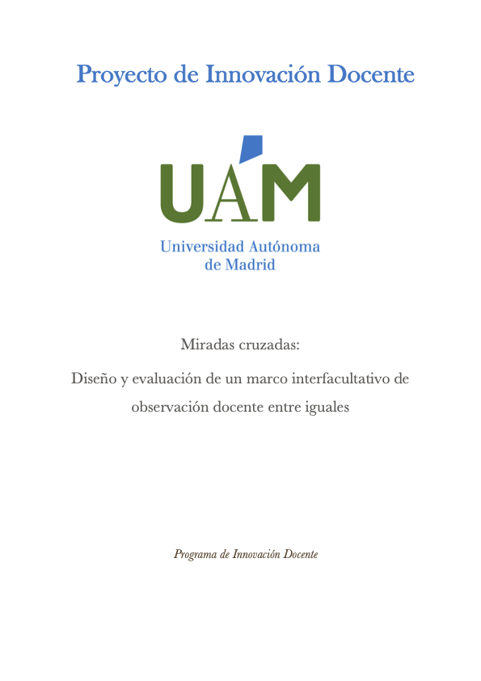
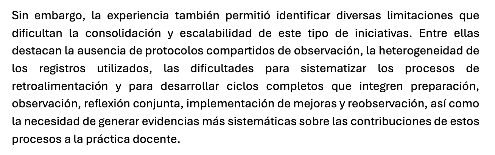
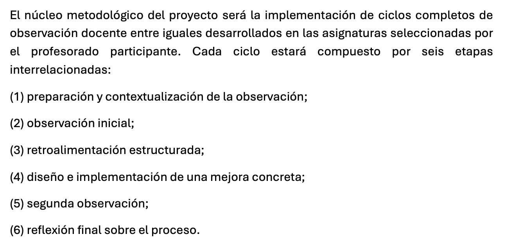
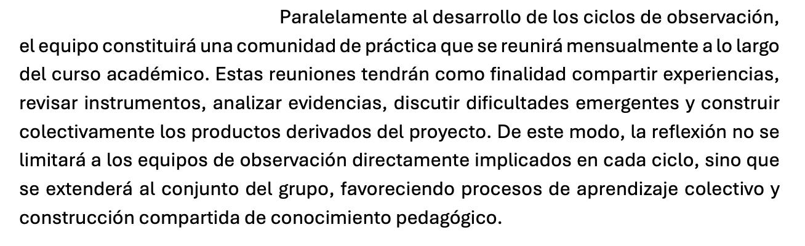

::: evidence-page

::: evidence-header

::: evidence-kicker
Evidencia · Parte III
:::

::: evidence-title
Diseñar lo que hace posible el cambio
:::

::: evidence-subtitle
Proyecto de Innovación Docente: Miradas cruzadas (2026)
:::

:::

::: evidence-layout

::: evidence-aside

::: evidence-cover

:::

::: evidence-meta
**Programa:** Proyecto de Innovación Docente

**Año:** 2026
:::

:::

::: evidence-main
Esta evidencia recoge fragmentos de la comunicación presentada al III Congreso de Innovación Docente de las Universidades Madrileñas y del Proyecto de Innovación Docente desarrollado a partir de ella. Al releer ambos documentos, reconozco un cambio importante en mi manera de entender el cambio docente.

Durante mucho tiempo tendí a prestar atención principalmente a las decisiones que toman las personas cuando intentan mejorar su práctica. Sin abandonar esa mirada, empecé a comprender que muchas transformaciones dependen también de algo menos visible: las condiciones que permiten que la reflexión compartida, la observación entre iguales y el aprendizaje profesional puedan sostenerse más allá de experiencias puntuales.

Lo que inicialmente aparecía como una experiencia valiosa de observación entre iguales empezó a plantear una pregunta diferente: qué hace falta para que ese tipo de experiencias no dependan únicamente de la motivación de quienes participan, sino que puedan consolidarse, transferirse y mantenerse en el tiempo.

### Del pilotaje a la necesidad de estructura

::: evidence-reading
La comunicación presentada al congreso de innovación docente permitió sistematizar el pilotaje de observaciones entre iguales desarrollado durante el segundo año del TEMU. Ese ejercicio de escritura colectiva ayudó a transformar una experiencia formativa en un objeto de análisis compartido.

Al poner en común lo observado, se hizo más evidente que el potencial de la observación entre iguales no dependía solo de la implicación del profesorado participante. Para sostener y transferir la experiencia era necesario avanzar hacia protocolos compartidos, instrumentos flexibles, espacios planificados de devolución y ciclos sucesivos de mejora.
:::

::: evidence-fragment

::: evidence-caption
Extracto de la comunicación presentada al III Congreso de Innovación Docente de las Universidades Madrileñas sobre las condiciones necesarias para consolidar la observación entre iguales.
:::
:::

### Diseñar procesos para favorecer la reflexión

::: evidence-reading
Uno de los cambios más relevantes fue empezar a pensar la innovación docente no solo en términos de actividades o metodologías, sino como diseño de procesos. El proyecto se construye alrededor de ciclos completos que integran observación, retroalimentación, implementación de mejoras y reflexión compartida.

La atención se desplaza así desde las acciones concretas hacia las condiciones que permiten que esas acciones generen aprendizaje profesional.
:::

::: evidence-fragment

::: evidence-source
Extracto sobre la estructura de los ciclos de observación y mejora.
:::
:::

### Crear estructuras que permanezcan

::: evidence-reading
Otra cuestión que comenzó a adquirir importancia fue la sostenibilidad de los procesos de aprendizaje docente. La reflexión compartida deja de entenderse como una actividad puntual para convertirse en una práctica que requiere espacios, tiempos y dinámicas específicas.

El proyecto incorpora reuniones periódicas, procesos colectivos de análisis y mecanismos para compartir experiencias, con el objetivo de que el aprendizaje no dependa únicamente de iniciativas individuales.
:::

::: evidence-fragment

::: evidence-source
Extracto sobre la comunidad de práctica y el aprendizaje colectivo.
:::
:::

### Lo que veo hoy al releer esta evidencia

::: evidence-reflection
Al releer estos materiales reconozco una transformación importante en mi manera de entender el acompañamiento docente. La atención deja de centrarse exclusivamente en las personas y empieza a dirigirse también hacia las condiciones que hacen posible el aprendizaje profesional.

Acompañar ya no significa únicamente ayudar a otros a reflexionar sobre su práctica. Empieza a significar también diseñar estructuras, tiempos y espacios que permitan que esa reflexión ocurra, se sostenga y pueda generar cambios duraderos.

En retrospectiva, uno de los aprendizajes más importantes de este proceso ha sido comprender que muchas veces el cambio no depende únicamente de las decisiones que toman las personas, sino de la arquitectura que hace posibles esas decisiones. Empiezo a reconocer así una faceta del acompañamiento que apenas intuía al inicio del TEMU: la responsabilidad de diseñar condiciones que permitan que otros puedan observar, reflexionar y aprender juntos.
:::

[Volver a Parte III - sostener](../part3.html){.evidence-back-button}

:::

:::

:::