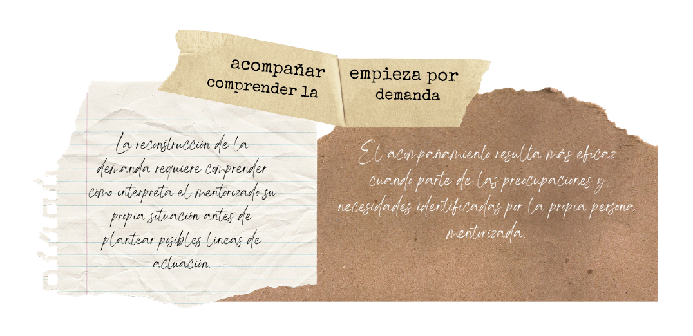
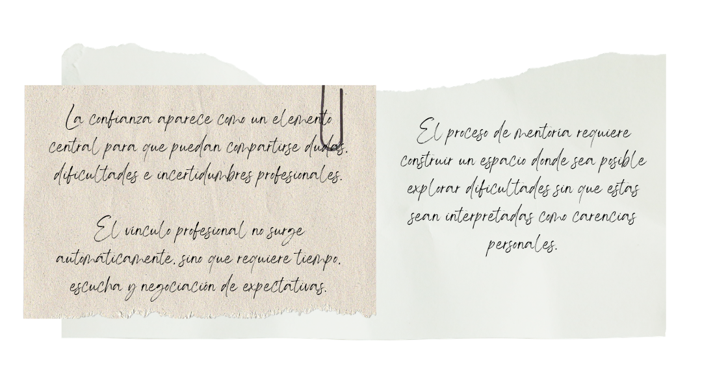
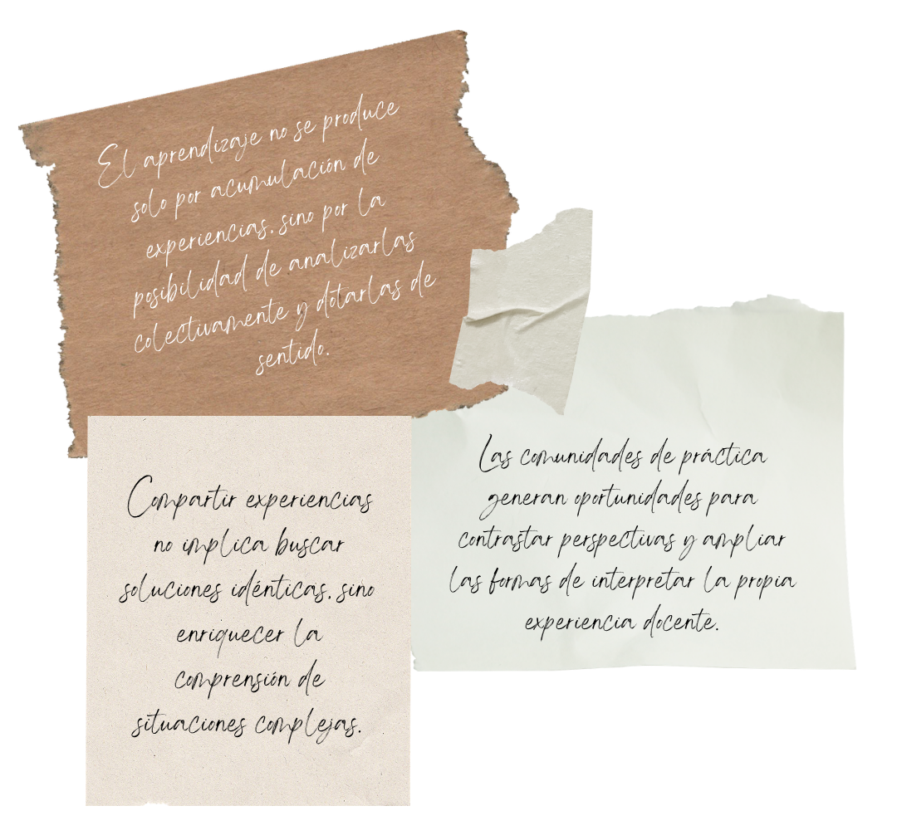

::: evidence-page

::: evidence-header

::: evidence-kicker
Evidencia · Parte I
:::

::: evidence-title
Acompañar las relaciones que hacen posible el cambio
:::

::: evidence-subtitle
Título de Experto en Mentoría Universitaria, primer año (2025)
:::

:::

::: evidence-layout

::: evidence-aside

::: evidence-cover

:::

::: evidence-meta
**Programa:** Título de Experto en Mentoría Universitaria (UAM)

**Año:** 2024-2026

**Dimensión:** Relacional
:::

:::

::: evidence-main

Esta evidencia recoge extractos de distintos trabajos, actividades y reflexiones elaborados durante el primer año del Título de Experto en Mentoría Universitaria (TEMU). Al releerlos hoy desde la dimensión relacional, reconozco un cambio progresivo en mi manera de comprender el acompañamiento docente.
La mentoría deja de aparecer únicamente como un proceso de orientación o apoyo a la mejora y empieza a entenderse como una relación profesional que necesita construirse: requiere escucha, confianza, negociación de expectativas y construcción compartida de sentido.

### Qué empezaba a cuestionar

::: evidence-reading
Al inicio del programa tendía a entender el acompañamiento docente desde una lógica relativamente orientadora: identificar necesidades, ayudar a clarificar problemas y proponer posibles líneas de mejora. Sin embargo, las reflexiones elaboradas durante el primer año del TEMU muestran que empecé a cuestionar esa manera de situarme en la relación de mentoría.

La reconstrucción de la demanda me llevó a comprender que no basta con identificar un problema docente desde fuera. Antes de acompañar un proceso de cambio, es necesario comprender cómo interpreta la persona mentorizada su propia situación, qué sentido atribuye a sus dificultades y qué condiciones hacen posible que pueda revisarlas sin sentirse juzgada.
:::

::: evidence-fragment

::: evidence-caption
Extractos sobre reconstrucción de la demanda y escucha de la perspectiva del mentorizado.
:::
:::

### Cómo cambió mi manera de entender la relación de mentoría

::: evidence-reading
Uno de los desplazamientos más relevantes fue empezar a concebir la relación de mentoría no como un contexto previo al trabajo, sino como parte del propio trabajo. La confianza, la escucha y la negociación de expectativas dejaron de aparecer como elementos deseables pero secundarios, y empezaron a adquirir un valor metodológico y formativo.

Los textos muestran cómo comenzó a emerger una idea de acompañamiento basada en la construcción de un espacio seguro para formular dudas, reconocer incertidumbres y explorar dificultades profesionales sin convertirlas en carencias personales. La relación, en este sentido, se convierte en una condición para que la reflexión sea posible.
:::

::: evidence-fragment

::: evidence-source
Extractos sobre confianza, escucha y construcción del espacio de mentoría.
:::
:::

### Qué implicaciones tenía para el aprendizaje profesional

::: evidence-reading
Estas comprensiones empezaban a desplazar también mi manera de entender el aprendizaje docente. La mejora ya no aparecía únicamente como un proceso individual, dependiente de la reflexión personal o de la incorporación de nuevas estrategias, sino como un proceso que se construye con otros.

Las comunidades de práctica y los espacios de colaboración me llevaron a valorar la importancia de contrastar perspectivas, compartir interpretaciones y construir conjuntamente el sentido de las experiencias docentes. Aprender profesionalmente implicaba no solo acumular experiencias, sino disponer de espacios relacionales donde esas experiencias pudieran analizarse y resignificarse.
:::

::: evidence-fragment

::: evidence-source
Extractos sobre colaboración, comunidades de práctica y aprendizaje profesional compartido.
:::
:::

### Lo que veo hoy al releer esta evidencia

::: evidence-reflection
Al releer estos materiales reconozco una de las transformaciones más importantes de mi paso por el TEMU: empezar a comprender que la mentoría no se sostiene únicamente en herramientas, procedimientos o recomendaciones, sino en la calidad de la relación profesional que permite trabajar con ellas.

Hoy veo con más claridad que acompañar no significa ocupar el lugar de quien sabe qué debe cambiar, sino contribuir a construir un espacio donde sea posible interpretar la práctica, formular preguntas, revisar supuestos y tomar decisiones con sentido. La relación no es solo el marco en el que ocurre la mentoría; es una de las condiciones que hacen posible el cambio docente.
:::

[Volver a Parte I - comprender](../part1.html){.evidence-back-button}

:::

:::

:::