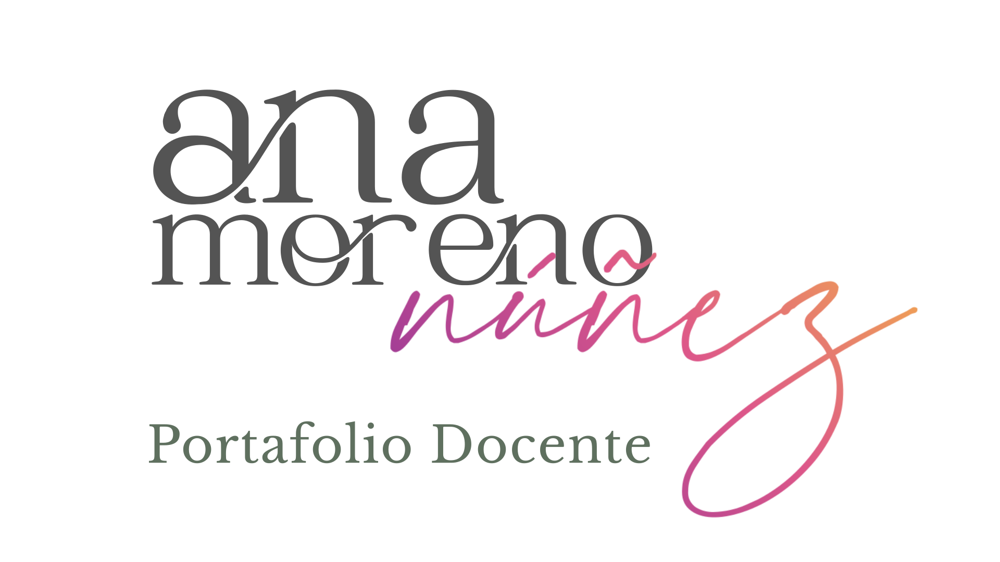

::: {.home-hero}

::: {.home-hero__logo}
{.home-logo alt="Logo Ana Moreno Núñez"}

::: {.home-keywords}
:::

::: {.social-icons}
<a href="https://scholar.google.com/citations?user=N9SVyYwAAAAJ&hl=es&oi=ao" aria-label="Google Scholar"><iconify-icon icon="academicons:google-scholar"></iconify-icon></a>
<a href="https://orcid.org/0000-0002-0397-2513" aria-label="ORCID"><iconify-icon icon="academicons:orcid"></iconify-icon></a>
<a href="https://www.researchgate.net/profile/Ana_Moreno_Nunez" aria-label="ResearchGate"><iconify-icon icon="academicons:researchgate"></iconify-icon></a>
<a href="https://github.com/moreno-nunez" aria-label="GitHub"><i class="bi bi-github"></i></a>
<a href="mailto:ana.moreno@uam.es" aria-label="Email"><i class="bi bi-envelope"></i></a>
:::
:::

::: {.home-hero__text}

::: home-heading
comprender el cambio
:::

::: home-program
Título de Experto en Mentoría Universitaria · TEMU-UAM
:::

::: home-intro
Este portafolio documenta las reflexiones desarrolladas en el marco del TEMU. Reúne algunos aprendizajes significativos construidos durante la formación, las evidencias que ilustran su impacto en mi práctica docente y cómo estos aprendizajes orientan mi desarrollo como mentora.

Más allá del diseño, la planificación y la toma de decisiones fundamentadas, este recorrido explora cómo algunas certezas se transforman cuando el foco se desplaza hacia la comprensión de los procesos que sostienen el cambio.
:::

:::

:::