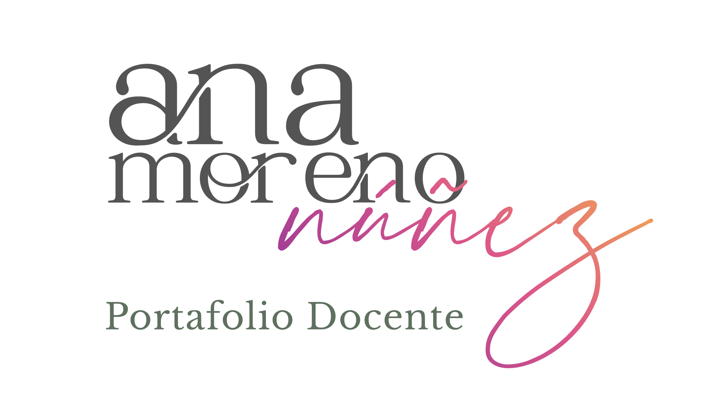

::: {.home-hero}

::: {.home-hero__text}

::: home-heading
Identidad y Desarrollo Profesional
:::

::: home-program
docencia universitaria · reflexión sobre la práctica · mentoría
:::

::: home-intro
Este portafolio documenta y analiza evidencias, aprendizajes y preguntas que han ido transformando mi manera de entender la docencia universitaria, el acompañamiento entre iguales y el desarrollo profesional docente.

Iniciado en el marco del Título de Experto en Mentoría Universitaria (TEMU-UAM), se mantiene como un espacio abierto y en evolución desde el que reconstruir decisiones, revisar la práctica e incorporar nuevos aprendizajes a medida que esta continúa desarrollándose.
:::

:::

::: {.home-hero__logo}
{.home-logo alt="Logo Ana Moreno Núñez"}

::: {.home-keywords}
:::

::: {.social-icons}
<a href="https://scholar.google.com/citations?user=N9SVyYwAAAAJ&hl=es&oi=ao" aria-label="Google Scholar"><iconify-icon icon="academicons:google-scholar"></iconify-icon></a>
<a href="https://orcid.org/0000-0002-0397-2513" aria-label="ORCID"><iconify-icon icon="academicons:orcid"></iconify-icon></a>
<a href="https://www.researchgate.net/profile/Ana_Moreno_Nunez" aria-label="ResearchGate"><iconify-icon icon="academicons:researchgate"></iconify-icon></a>
<a href="https://github.com/moreno-nunez" aria-label="GitHub"><i class="bi bi-github"></i></a>
<a href="mailto:ana.moreno@uam.es" aria-label="Email"><i class="bi bi-envelope"></i></a>
:::
:::

:::