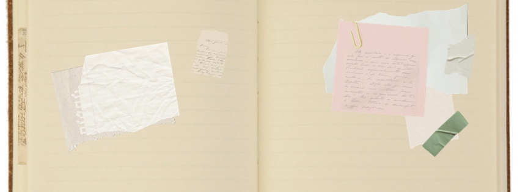

:::::::::::::::::::::::::::::::::: part0-page
:::::::: part0-hero
::: part0-kicker
Parte 0 · empezar
:::

::: part0-title
# punto de partida {.part0-title}
:::

::: part0-subtitle
Desde dónde escribo este portafolio
:::

:::: part0-hero-bottom
::: part0-hero-image

:::
::::
::::::::

::: part0-note
## Clave de lectura

Este portafolio parte de una lógica presente también en mi trabajo sobre desarrollo temprano: algunos de los cambios más importantes comienzan a tomar forma antes de hacerse visibles. No como una metáfora, sino como una forma de centrarse menos en los resultados y más en los procesos de comprensión que los hacen posibles.
:::

::::::: {.part0-lienzo .part0-temdu}
::: part0-lienzo-tag
INICIOS
:::

:::: part0-lienzo-main

trayectoria previa

Una forma de entender el aprendizaje.

::::

::: part0-lienzo-panel

Mucho antes de participar en programas de formación docente, mi trabajo ya giraba en torno a una pregunta recurrente: cómo se producen los procesos de aprendizaje y qué hace posible ese cambio.

Estudiar el desarrollo temprano me enseñó a observar procesos que no siempre son inmediatos ni visibles.

Con el tiempo, esa forma de mirar, construida entre la investigación y la docencia, terminó orientando también cómo interpreto la enseñanza y el desarrollo profesional docente.

:::
:::::::

::::::: {.part0-lienzo .part0-docentia #tedu}
::: part0-lienzo-tag
HERRAMIENTAS
:::

:::: part0-lienzo-main

diseñar cambios

La mejora docente como objeto de análisis

<a class="part0-evidence-button" href="evidence/project-tedu.html">explorar la evidencia</a>
::::

::: part0-lienzo-panel

Mi primer acercamiento sistemático a la innovación docente se desarrolló durante mi participación en el TEMDU, donde desarrollé un proyecto de cambio centrado en la asignatura Desarrollo Cognitivo y Lingüístico, del Grado en Psicología.

Más adelante, otras experiencias reforzaron una manera de trabajar basada en la planificación, la coherencia y el uso de evidencias para mejorar la práctica.

Pero durante años entendí el cambio docente principalmente desde esa lógica de diseño y evaluación. Revisar experiencias pasadas me ha permitido reconocer tanto el valor como los límites de esa mirada.

:::
:::::::

::::::: {.part0-lienzo .part0-preguntas #docentia}
::: part0-lienzo-tag
ESTRATEGIAS
:::

:::: part0-lienzo-main

preguntas abiertas

Lo que seguía sin encajar del todo.

<a class="part0-evidence-button" href="evidence/docentia.html">explorar la evidencia</a>
::::

::: part0-lienzo-panel

A pesar de esa trayectoria, algunas preguntas persistían. Con el tiempo he ido comprobando que ciertas cuestiones centrales de la práctica docente no desaparecen con más experiencia, formación o herramientas.

Más que resolverse, reaparecen bajo formas distintas y obligan a volver sobre los mismos problemas desde nuevas perspectivas.

Esa persistencia ha ido desplazando mi atención desde la búsqueda de soluciones hacia la comprensión de aquello que ocurre entre las decisiones docentes y sus efectos.

:::
:::::::

::::::: {.part0-lienzo .part0-temu}
::: part0-lienzo-tag
REDES
:::

:::: part0-lienzo-main

acompañar procesos

Una comprensión construida en diálogo.

::::

::: part0-lienzo-panel

Llegué al TEMU con experiencias previas, pero también con la sensación de que algunas preguntas necesitaban otros espacios para ser pensadas.

El principal valor de esta experiencia no ha estado en incorporar nuevas herramientas, sino en disponer de tiempo, contraste y conversación para volver sobre las mismas situaciones desde perspectivas diferentes.

Más que ofrecer respuestas, el proceso ha ampliado mi forma de leer el cambio docente y los procesos de enseñanza y aprendizaje.

:::
:::::::

:::::: part0-question
::: part0-question-label
Una idea que permanece
:::

::: part0-question-intro

Este portafolio recoge principalmente desplazamientos en la manera de mirar, evaluar, intervenir y acompañar en la docencia.

Más que registrar cambios concretos, reconstruye cómo han cambiado las preguntas desde las que interpreto mi propia práctica.

:::

::: part0-question-main
El principal avance no es hacer algo distinto, sino entender lo que hago de otra manera
:::
::::::
::::::::::::::::::::::::::::::::::
