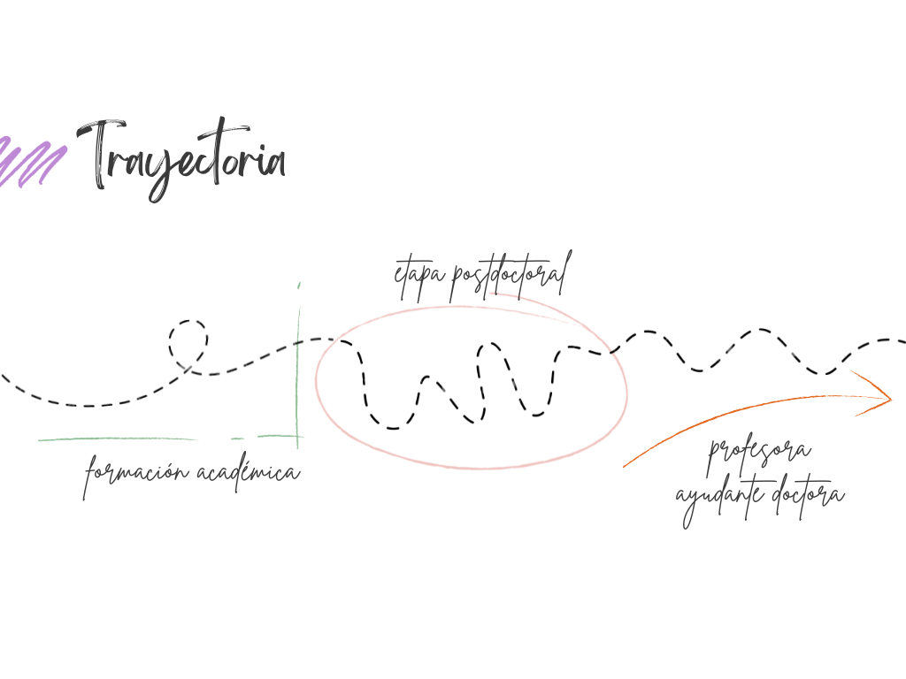

::::::::::::::::::::::::::::::: part0-page
:::::::::: part0-hero
::: part0-kicker
Parte II · acompañar
:::

::: part0-title
# toma de decisiones {.part0-title}
:::

::: part0-subtitle
Límites, posibilidades y decisiones emergentes
:::

:::::: part0-hero-bottom
::: part0-hero-image

:::
::::::
::::::::::

::: part0-note
## Clave de lectura

Durante el segundo año del TEMU, la atención se desplaza desde la comprensión de los procesos hacia las decisiones que empiezan a derivarse de ella.
Esta parte no recoge transformaciones consolidadas, sino cambios en la forma de decidir, reconocer condiciones necesarias para el cambio e identificar límites que antes pasaban más desapercibidos.
:::

::::::: {.part0-lienzo .part0-temdu}
::: part0-lienzo-tag
DECIDIR
:::

:::: part0-lienzo-main

antes de intervenir

Comprender también es una forma de decidir.

<a class="part0-evidence-button" href="ruta/a/tu/evidencia.pdf">Ver evidencia</a>
::::

::: part0-lienzo-panel

Algunas decisiones han dejado de organizarse alrededor de la rapidez de la respuesta para desplazarse hacia la calidad de la comprensión.

Cada vez resulta más evidente que acompañar no consiste únicamente en proponer soluciones, sino también en decidir cuándo detenerse, reformular una demanda, introducir una pregunta o esperar antes de intervenir.

La atención se desplaza así desde la búsqueda inmediata de respuestas hacia la construcción de una lectura más precisa de la situación.

:::
:::::::

::::::: {.part0-lienzo .part0-docentia}
::: part0-lienzo-tag
RECONOCER
:::

:::: part0-lienzo-main

lo que sostiene

El cambio depende también de las condiciones que permiten sostenerlo.

<a class="part0-evidence-button" href="ruta/a/tu/evidencia.pdf">Ver evidencia</a>
::::

::: part0-lienzo-panel

Durante mucho tiempo tendí a fijarme sobre todo en las decisiones, las propuestas o las acciones que podían impulsar una transformación.

Poco a poco, algunas situaciones empezaron a mostrar que el cambio depende también de aquello que permite sostenenerlo.

El vínculo, el tiempo disponible, las oportunidades para revisar el proceso o las condiciones institucionales dejan de aparecer como elementos de contexto para ocupar un lugar central en la lectura de las situaciones.

:::
:::::::

::::::: {.part0-lienzo .part0-temu}
::: part0-lienzo-tag
SOSTENER
:::

:::: part0-lienzo-main

tensiones abiertas

Comprender mejor no elimina necesariamente los límites del proceso.

<a class="part0-evidence-button" href="ruta/a/tu/evidencia.pdf">Ver evidencia</a>
::::

::: part0-lienzo-panel

A medida que algunas situaciones empiezan a leerse con mayor complejidad, también se vuelve más visible aquello que no depende por completo de la calidad de las decisiones tomadas.

Algunos obstáculos remiten a las condiciones institucionales en las que trabajamos, otros aparecen en la propia práctica profesional, otros surgen allí donde dos prioridades igualmente valiosas entran en tensión.

Entre ellas, una pregunta adquiere un peso creciente: cómo introducir el desafío necesario para que algo pueda cambiar sin poner en riesgo el vínculo que hace posible sostener ese cambio.

:::
:::::::

:::::: part0-question
::: part0-question-label
Pregunta que atraviesa esta parte
:::

::: part0-question-intro
Comprender mejor una situación no garantiza poder transformarla. Sin embargo, modifica la forma de decidir, desplaza la atención hacia las condiciones que sostienen los procesos y hace más visibles tensiones que no siempre pueden resolverse.
:::

::: part0-question-main
Algunas de las decisiones más importantes no consisten en intervenir, sino en comprender mejor qué hace posible —o imposible— el cambio
:::
::::::
:::::::::::::::::::::::::::::::
